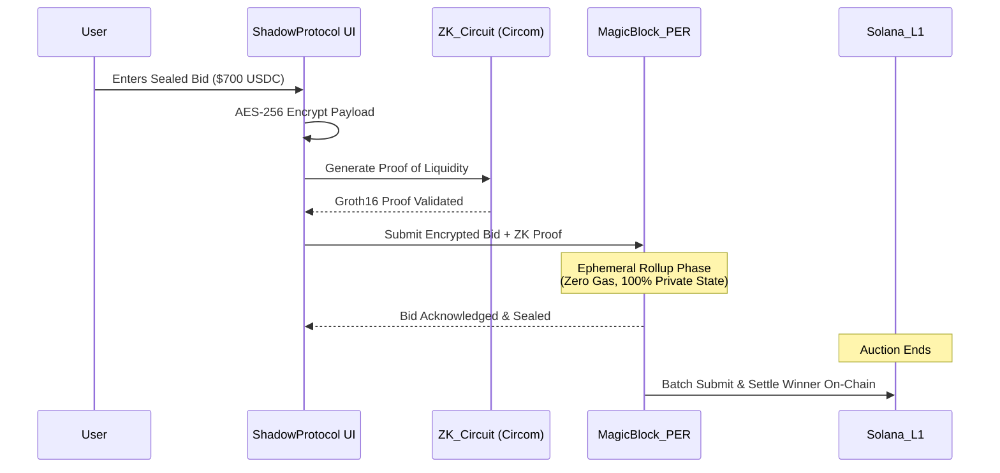

<div align="center">
  
# 🌑 ShadowBid Protocol
### *Zero-Knowledge Confidential Auctions & Institutional Dark Pools on Solana*

[](https://earn.superteam.fun/)
[](https://magicblock.gg/)
[](https://solana.com/)

**The ultimate cure for MEV, Front-running, and Value Leakage in Decentralized Finance.**

[Live MVP](https://dakshrawat298-gif.github.io/ShadowBid/) • [Pitch Video](#) • [Technical Architecture](#-architecture--magicblock-integration)


</div>

---

## 🛑 The Core Primitive: Why ShadowBid Exists?
In the current DeFi landscape, transparency is a double-edged sword. When institutional players or whales execute large OTC blocks or participate in auctions, their intent is broadcasted to the public mempool. This leads to **catastrophic front-running** and **MEV extraction** by malicious bots.

**ShadowBid** introduces the concept of **"Privacy as a Primitive"**. We have engineered a zero-knowledge auction protocol where bids remain entirely sealed, cryptographically verified, and routed through private ephemeral rollups until the auction concludes. 

---

## 🧠 Technology Stack & MagicBlock Synergy
To achieve sub-second latency while maintaining absolute privacy, ShadowBid pushes the boundaries of Solana's composability by integrating **MagicBlock**.

* **Private Ephemeral Rollups (PER):** High-frequency bidding logic is decoupled from the Solana L1. Bids are submitted to MagicBlock's PER, ensuring zero gas fees during the active auction phase and hiding the state from the public ledger.
* **Zero-Knowledge Proofs (Groth16 / Circom 2.0):** Before a bid enters the rollup, a ZK-proof is generated locally. This proves the bidder has sufficient USDC/SOL liquidity *without* revealing their wallet address or bid amount.
* **AES-256-GCM Ephemeral Keys:** Peer-to-peer encryption for bid payloads before they even touch the RPC node.
* **Solana L1 Settlement:** Once the auction timer concludes, the rollup state is cryptographically verified and seamlessly settled back onto the Solana mainnet.

---

## 🏗 Architecture Flow (The "Dark Pool" Engine)



---

## 🚀 The "100% Mobile" Underdog Reality
This isn't just an integration flex; it's a statement on the accessibility of Web3. 
**The entire ShadowBid protocol—frontend UI, cryptographic routing, MagicBlock integration, and smart logic—was orchestrated and coded entirely on an iPhone 13 via Replit.** No high-end MacBooks, just raw determination and AI leverage. Hardware is no longer a barrier to building frontier tech on Solana.

---

## 💼 Business Model & Impact
ShadowBid is designed for immediate monetization and real-world adoption:
1. **Institutional OTC Desks:** A secure environment for DAOs and whales to liquidate large positions without crashing the spot market.
2. **Protocol Revenue:** ShadowBid enforces a **0.1% dynamic settlement fee** on the winning bid, creating a sustainable, cash-flow-positive protocol from Day 1.

---

## ⚙️ How to Run Locally

Experience the dark pool locally:

```bash
# 1. Clone the repository
git clone [https://github.com/dakshrawat298/ShadowBid.git](https://github.com/dakshrawat298/ShadowBid.git)

# 2. Navigate to directory
cd ShadowBid

# 3. Install dependencies
npm install

# 4. Configure Environment
# Rename .env.example to .env and add your Solana RPC and MagicBlock API Keys

# 5. Ignite the protocol
node server.js
```
*Note: Ensure your Solana wallet is set to Devnet for the MagicBlock test environment to process the ephemeral rollups correctly.*

---
<div align="center">
<i>"True privacy isn't about hiding; it's about giving users the power to choose what they reveal."</i><br>
<b>Built for the Solana Ecosystem 🖤</b>
</div>
